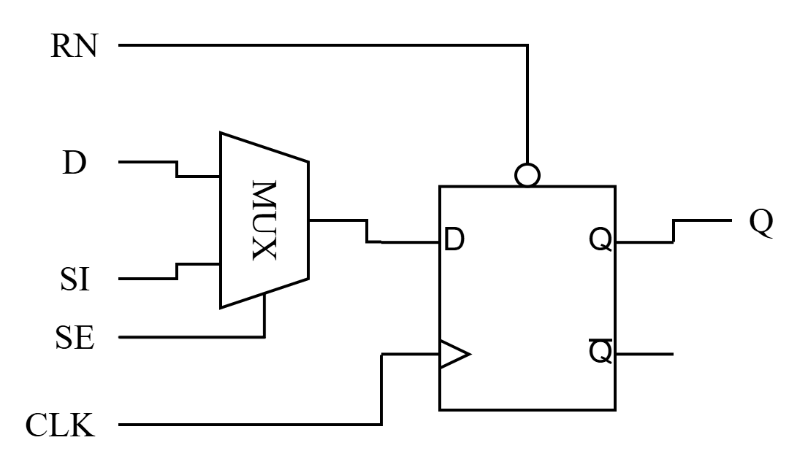
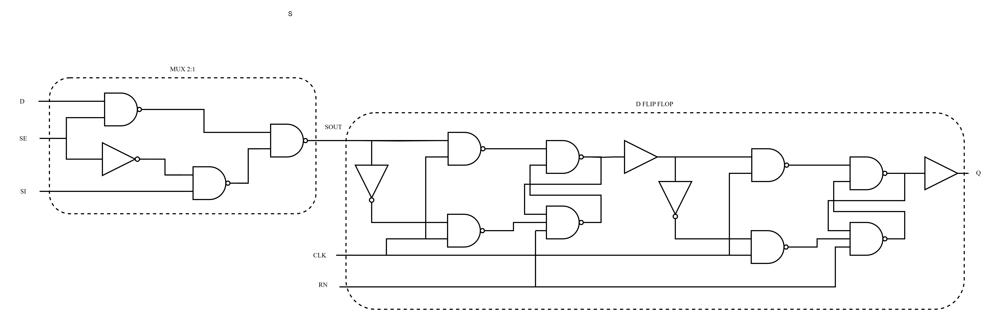
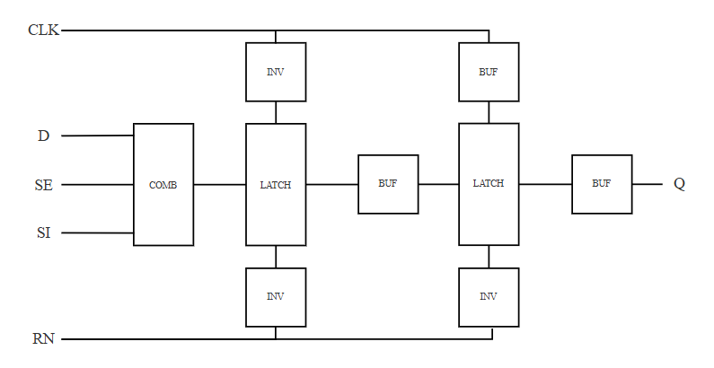
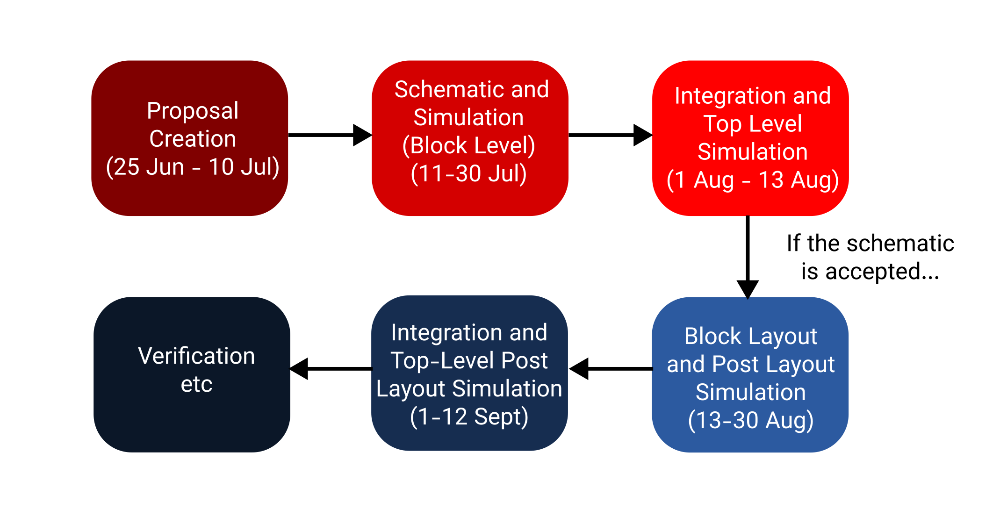

# VoidWalkers Scan D Flip-Flop for GF180MCU D (SSCS Chipathon 2025)

We are team VoidWalkers participating in Digital Track of SSCS Chipathon 2025. For our proposal, we would like to create a scan D Flip-Flop (Scan DFF), which hopefully enables digital designers to create digital designs with DFT capability in mind. 

### Background 

Design for Testability (DFT) is an important design principle especially in VLSI design. DFT encourages a designer to include features for testing after manufacturing, so the functionality of the device can be verified before delivery to customers. This is important in VLSI design because of the delicate manufacturing process of the chips, making conventional testing very hard or even impossible to produce reliable result since the DUT (Device Under Test) are very small and not every elements is accessible from outside. 

One implementation of DFT is making a testable elements to aid in verification process later, which is what the Scan DFF aims to do. It enables the designer to inject arbitrary data to the registers, allowing more complex test with arbitrary data contents for debugging CPUs and the like. It is an integral part of JTAG Debugging mechanism

### Overview

Scan DFF is essentially a regular DFF with a 2:1 multiplexer in its data port. This multiplexer is a selector between normal DFF operation and Scan DFF, which can be injected with arbitrary bits. The MUX has 2 inputs, Data in and Scan in, and select which one is to be passed based on the condition of Scan Enable pin. The block diagram is as follows : 

We intended to apply the standar cells of microcontroller, so it has to be fast and support 3.3V, though as long as the design is intended to be in 3.3V it is still perfectly usable. We also want this cell to support more fanout, so it can be used for more complex design without requiring additional buffers. This use case determines our specification listed in the table below : 

| Specification     | Value | Unit | Notes |
| ----------------- |:-----:|:----:|:-----:|
| Operating Voltage |3.3    |V     |       |
| Maximum Frequency |100    |MHz   |proposed Fmax, based on GF180MCU D lib file|
| Maximum Fanout    |4      |-     |Enables complex design when keeping standar cell count low|
| Cell Height       |9      |Layers|Per GF180MCU D specification|
| Input ports       |5      |Ports |CLK, D, SI, SE, RN|
| Output ports      |1      |Ports |Q|
| Cell Area         |TBD    |um2   |We are unable to determine proposed area usage at the moment|

## Design and Work Details
The design will be fully static, as the frequency is still low enough to be handled by static logic gates. The implementation will use the regular logic gate made of PFET and NFET, but will be adjusted to minimize area usage while retaining frequency and drive strength rating. The proposed gate-level and functional-level diagram can be seen below : 

### Gate Level

### Functional Level

Our team consists of 3 people, which will handle the design and layouting with following task division : 
+ Flip Flop design and Layout : 
    1. Aakarsh
    2. Ahmad Jabar Ilmi
+ Multiplexer Design and Layout : Snighdha 

The workflow will proceed according to the proposed timeline, shown in figure below : 

Since the structure is quite different, the truth table is slightly diferent compared to the normal DFF. The truth table is as follows : 
| D    | SI   | SE   | RN | CLK     | Q           |
|:----:|:----:|:----:|:--:|:-------:|:-----------:|
| 1    | 0    | 0    | 1  | Rising  | 0           |
| 1    | 1    | 0    | 1  | Rising  | 1           |
| 0    | 1    | 0    | 1  | Rising  | 1           |
| 0    | 0    | 0    | 1  | Rising  | 0           |
| 0    | 0    | 1    | 1  | Rising  | 0           |
| 0    | 1    | 1    | 1  | Rising  | 0           |
| 1    | 0    | 1    | 1  | Rising  | 1           |
| 1    | 1    | 1    | 1  | Rising  | 1           |
| x    | x    | x    | 1  | 0       | Prev. State |
| x    | x    | x    | 1  | 1       | Prev. State |
| x    | x    | x    | 1  | Falling | Prev. State |

The work will be done in 3 months timespan, and consists of 4 crucial stages : 
+ Proposal Creation
+ Schematic design and Pre-Layout Simulation
+ Layout Design and Post-Layout Verification
+ Standard Cell Characterization

We are hoping that our work will be useful for everyone, as well as accepted to be part of the new GF180MCU Standard Cells

***

This repository used the template for the IIC-OSIC-TOOLS (https://github.com/iic-jku/IIC-OSIC-TOOLS) analog design workflow for the SSCS 2025 Chipathon, preconfigured for the GlobalFoundries 180nm PDK (gf180mcuD).
